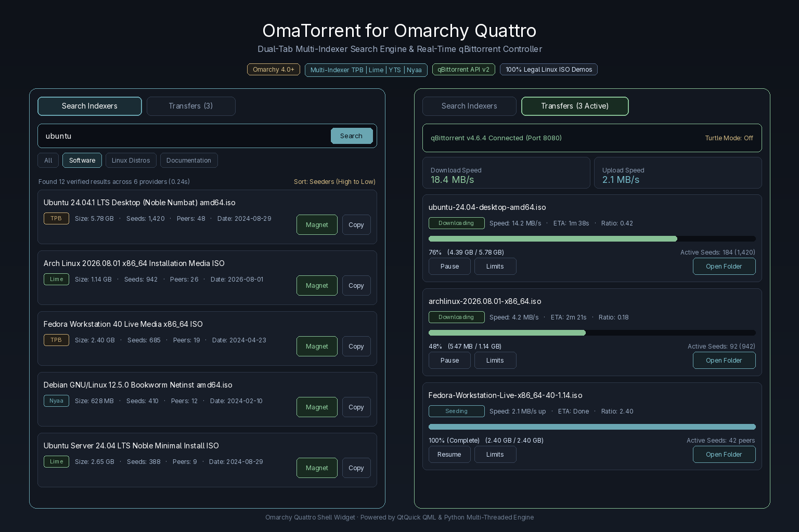

# OmaTorrent for Omarchy

[](https://omarchy.org/manual/shell-plugins/)
[](https://github.com/ucmz851/omatorrent)
[-87c095?style=flat-square)](https://github.com/ucmz851/omatorrent)
[](LICENSE)

An ultra-fast, multi-source torrent search engine, filter aggregator, one-click magnet dispatcher, and live **qBittorrent controller** built natively for the **Omarchy Quattro bar**.



<p align="center"><sub>Native Omarchy Quattro bar widget: Dual-tab search aggregator & real-time qBittorrent transfer controller.</sub></p>

---

## ✨ Highlights

- **⚡ Multi-Indexer Parallel Search:** Simultaneously queries **ThePirateBay**, **LimeTorrents**, **YTS** (HD/4K Movies), **EZTV** (TV Episodes), **FitGirl Repacks** (PC Games), and **Nyaa** (Anime & Media) concurrently with real-time deduplication and sorting.
- **󰚌 Real-Time qBittorrent Monitor:** Live transfer cards displaying download/upload speeds, progress percentages (0–100%), ETA countdowns, completed vs total size, ratio metrics, and active DHT nodes.
- **⏸️ Full Transfer Management:** Instant 1-click **Pause/Resume** (compatible with qBittorrent 5.x `/stop`/`/start` & 4.x `/pause`/`/resume`), **Force Start**, **Data Recheck**, and selective deletion (**Remove Torrent** or **Delete with Files**).
- **⚙️ Global Bandwidth Throttling:** 1-click **Turtle Mode / Alternative Speed Limits** (`󱥸 / 󰓅`) and quick-select presets for global Download (`1 MB/s`, `5 MB/s`, `10 MB/s`, `25 MB/s`, `50 MB/s`, `Unlimited`) and Upload limits.
- ** Per-Torrent Speed Limiters:** Set granular download and upload speed caps on individual torrents directly from each transfer card.
- **󰉋 Download Directory Controls:** View current default save paths, launch folders directly in your Linux file manager (`xdg-open`), or edit default save locations inline.
- **🧲 One-Click Magnet Dispatcher:** Click `󰚌` on any search result to inject it directly into qBittorrent or dispatch to your preferred desktop client (`xdg-open`).
- **📋 Wayland Clipboard Integration:** Click `󰆏` to sanitize and copy clean magnet URIs directly to your clipboard via `wl-copy`.
- **⌨️ Keyboard-First Workflow:** Press shortcut or click the bar widget to open with immediate search input focus. Press `Enter` to search, `Esc` to close.
- **🎨 Dynamic Quattro Theming:** Automatically inherits your active Omarchy theme palette with alpha blending, high-contrast typography, and plain-text safety sanitization.

---

---

## 🎯 Recommended Client: qBittorrent

While OmaTorrent can dispatch magnet links to any desktop client (such as Transmission, Fragments, or Deluge) via `xdg-open`, **qBittorrent** is the **recommended BitTorrent client** to unlock the full potential of OmaTorrent.

### Why qBittorrent?
- **Full Dual-Tab Experience:** Enables the live **Transfers** dashboard directly inside the popout panel.
- **Real-Time Telemetry:** Stream live download/upload speeds, ETAs, active seed/peer ratios, and DHT node counts.
- **Bandwidth Throttling:** Switch on **Turtle Mode** (`󱥸 / 󰓅`) or set custom speed limits (global or per-torrent) on the fly.
- **Directory Controls:** View, open, or reconfigure default download folders directly from the widget.
- **Open-Source & Native:** Privacy-focused, lightweight, and native to Linux with zero adware (available in official distribution repositories as `qbittorrent`).

---

## 🚀 Quick Setup: Connecting qBittorrent (30 Seconds)

OmaTorrent connects directly to your local qBittorrent desktop app via its Web UI API with zero external servers required.

1. Open **qBittorrent** on your desktop.
2. Go to **Tools** ➔ **Preferences** (or press `Alt + O`) ➔ select the **Web UI** tab.
3. Check **"Web User Interface (Remote control)"** *(Default port is `8080`)*.
4. Check **"Bypass authentication for clients on localhost"** *(allows OmaTorrent to stream stats instantly without login prompts)*.
5. Click **Apply / OK**.

> [!TIP]
> **Custom Web UI Port?** If you use a port other than `8080` (e.g. `8085`, `9091`, `8000`), simply click the **"Auto-Detect"** button in OmaTorrent's Transfers tab, or enter your custom port into the port input field. OmaTorrent will automatically probe and save your active port.

---

## 📦 Installation

OmaTorrent requires Omarchy with shell plugin support.

```sh
omarchy plugin add https://github.com/ucmz851/omatorrent.git --enable
```

The shell normally picks up the plugin immediately. If the widget does not appear on your bar, reload the shell:

```sh
omarchy restart shell
```

---

## ⌨️ Navigation & Keybindings

| Action | Control / Shortcut | Result |
| :--- | :--- | :--- |
| **Open Panel** | Left-click bar icon (`󰚌`) | Opens OmaTorrent with instant search focus |
| **Quick Refresh** | Middle-click bar icon (`󰚌`) | Re-runs the last search query / refreshes transfers |
| **Execute Search** | `Enter` inside search input | Aggregates results across all selected providers |
| **Clear Search** | Click `✕` or press `Esc` | Resets query, results, and restores blank search state |
| **Switch Tabs** | Click `Search Indexers` / `Transfers` | Toggles between search engine and qBittorrent monitor |
| **Filter Categories** | Click category pill (`Movies`, `Games`, etc.) | Filters results and re-queries active providers |
| **Change Indexer** | Click provider dropdown | Switch between All Indexers (Aggregated) or a specific site |
| **Sort Results** | Click sort dropdown | Sort by Most Seeds, Largest Size, Smallest Size, or Date |
| **Send to qBittorrent**| Click `󰚌` on search card | Injects magnet directly into qBittorrent |
| **Copy Magnet** | Click `󰆏` on search card | Copies clean magnet URI to Wayland clipboard |
| **Pause / Resume** | Click `󰏤` / `󰐊` on transfer card | Pauses or resumes torrent transfer |
| **Torrent Options** | Click `` on transfer card | Expands per-torrent speed limits & directory drawer |
| **Open Folder** | Click `󰉋 Open Folder` | Opens the torrent download folder in your file manager |
| **Close Panel** | `Esc` key | Closes the popout panel |

---

## 🔍 Supported Indexers & Aggregation

OmaTorrent uses a lightweight, multi-threaded Python engine (standard library only) to query indexers in parallel:

| Provider | Category Coverage | Method / Protocol |
| :--- | :--- | :--- |
| **The Pirate Bay** | Movies, TV, Games, Software, Music, Anime | Direct JSON API (`apibay.org`) |
| **LimeTorrents** | General, Media, Applications, Repacks | High-speed HTML stream parser & infohash resolver |
| **YTS** | HD (720p/1080p) & 4K Ultra-HD Movies | Direct YIFY API with multi-resolution streams |
| **EZTV** | TV Shows, Complete Seasons & Daily Episodes | Direct Show API (`eztv.re`) |
| **FitGirl Repacks** | Verified PC Game Repacks | Direct RSS XML Feed & repack indexer |
| **Nyaa** | Anime, Asian Media, Soundtracks, Manga | High-speed XML RSS feed parser |

---

## ⚙️ Speed Limiters & Controls Reference

### Global Bandwidth Controls
- **Alternative Speed Limits (`󱥸 / 󰓅`):** 1-click toggle between full unconstrained bandwidth and throttled turtle limits.
- **Global Download Limits:** `Unlimited`, `1 MB/s`, `5 MB/s`, `10 MB/s`, `25 MB/s`, `50 MB/s`.
- **Global Upload Limits:** `Unlimited`, `250 KB/s`, `500 KB/s`, `1 MB/s`, `2 MB/s`, `5 MB/s`.
- **Default Save Directory:** View, open via `xdg-open`, or edit the global default download location directly in the panel.

### Per-Torrent Controls (`` Drawer)
- **Granular Speed Limits:** Set separate download/upload caps for individual active transfers.
- **Force Start:** Bypasses global queue and active download limits.
- **Data Integrity Check (` Recheck`):** Verifies existing piece hashes on disk.
- **Safe / Deep Deletion:** Choose between removing only the torrent task or deleting downloaded data files from disk.

---

## 🛡️ Privacy, Security & PlainText Guarantee

- **100% On-Device & Direct:** No intermediate proxies, tracking analytics, or telemetry collection.
- **Localhost API Binding:** qBittorrent communication is restricted to `127.0.0.1`.
- **PlainText Sanitization:** All scraped metadata, torrent titles, descriptions, and paths explicitly enforce `Text.PlainText` rendering in QML to eliminate rich-text or script injection vulnerabilities.
- **Zero Bloatware:** Built using standard Python (`urllib`, `json`, `re`) and native QtQuick primitives. No heavy third-party node/pip dependencies.

---

## 🛠️ Troubleshooting

#### 1. "Disconnected: Enable qBittorrent Web UI" message appears
- Ensure qBittorrent is running on your machine.
- Verify that **"Web User Interface (Remote control)"** and **"Bypass authentication for clients on localhost"** are enabled in qBittorrent **Preferences** ➔ **Web UI**.
- If running on a custom port, click **"Auto-Detect"** or type your port number into the Port field and click **Connect**.

#### 2. Magnets open in a different client instead of qBittorrent
- If qBittorrent Web UI is disconnected, OmaTorrent falls back to `xdg-open`. To set qBittorrent as your system default handler:
  ```sh
  xdg-mime default org.qbittorrent.qBittorrent.desktop x-scheme-handler/magnet
  ```

#### 3. Update to the latest version
```sh
omarchy plugin update ucmz851.omatorrent --yes
```

#### 4. Remove plugin
```sh
omarchy plugin remove ucmz851.omatorrent
```

---

## 💻 Development & Validation

Validate the plugin schema from the repository checkout:

```sh
omarchy plugin validate .
```

Test the search engine CLI directly:

```sh
python3 scripts/torrent_engine.py --query "ubuntu" --category software
```

Test the qBittorrent integration endpoint:

```sh
python3 scripts/torrent_engine.py --qbittorrent
```

---

## ⚖️ Legal Disclaimer & Anti-Piracy Policy

- **Metadata Aggregation Tool Only:** OmaTorrent is an open-source metadata search tool and local qBittorrent desktop controller. It does not host, store, upload, seed, index, or distribute any torrent files, video, audio, software, or copyrighted digital media.
- **Third-Party Public Sources:** All search queries, names, seed counters, and magnet URIs are retrieved on-demand from public third-party indexers and RSS feeds. The developers have no ownership, influence, or control over third-party providers or their indexed content.
- **No Copyright Ownership:** The developers do not claim any copyright, trademark, or ownership over materials indexed by external third-party search engines.
- **User Responsibility:** Users are solely responsible for ensuring that all search queries and P2P transfers comply with applicable local laws, regulations, and intellectual property rights. The author and contributors disclaim all liability for any unauthorized distribution, downloading, or misuse of copyrighted materials.

---

## 📜 License

[MIT License](LICENSE) © 2026 Usama Imran Cheema ([@ucmz851](https://github.com/ucmz851)).
